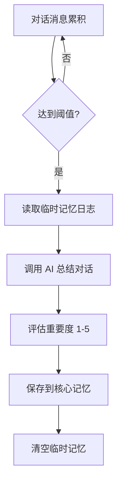
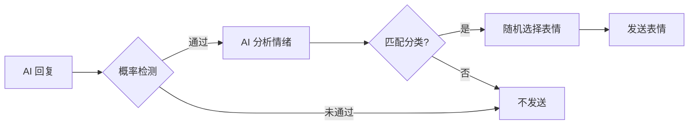
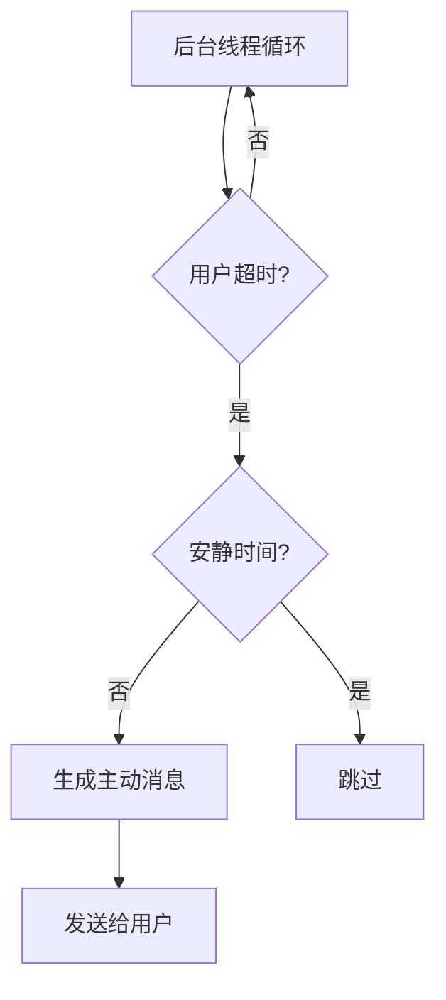
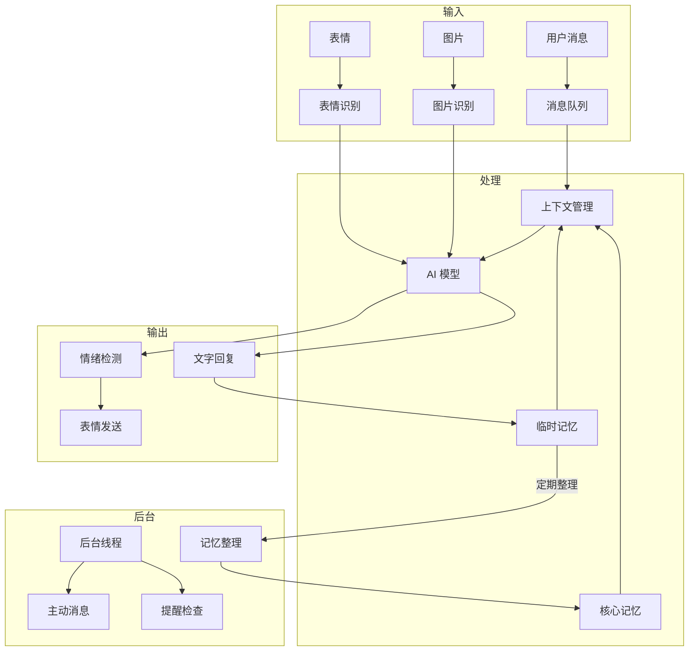

# 旧项目架构分析

> 分析对象：WeChatBot_WXAUTO_SE-3.24.5 (Python)

## 一、项目概述

基于 Python + wxauto 的微信机器人，支持 AI 对话、记忆管理、表情发送、图片识别等功能。

---

## 二、核心模块

### 1. 记忆系统

#### 1.1 临时记忆 (Memory_Temp)

**存储位置**

```
Memory_Temp/{user_id}_{prompt_name}_log.txt
```

**数据格式**

```
2025-01-01 10:00:00 | [用户] 你好啊
2025-01-01 10:00:05 | [AI] 你好！有什么可以帮你的？
```

**配置项**

| 配置 | 说明 | 默认值 |
|------|------|--------|
| `MEMORY_TEMP_DIR` | 临时记忆目录 | `Memory_Temp` |
| `MAX_MESSAGE_LOG_ENTRIES` | 最大日志条数 | 30 |

**核心函数**

```python
def clear_memory_temp_files(user_id):
    """清除指定用户的Memory_Temp文件"""
    log_file = os.path.join(MEMORY_TEMP_DIR, f'{user_id}_{prompt_name}_log.txt')
    if os.path.exists(log_file):
        os.remove(log_file)
```

---

#### 1.2 核心记忆 (CoreMemory)

**存储位置**

```
CoreMemory/{user_id}_{prompt_name}_core_memory.json
```

**数据结构**

```json
[
  {
    "timestamp": "2025-01-01 Monday 10:00:00",
    "summary": "用户喜欢编程，尤其是 Python",
    "importance": 5
  },
  {
    "timestamp": "2025-01-01 Monday 11:00:00",
    "summary": "用户今天心情不太好",
    "importance": 3
  }
]
```

**配置项**

| 配置 | 说明 | 默认值 |
|------|------|--------|
| `CORE_MEMORY_DIR` | 核心记忆目录 | `CoreMemory` |
| `MAX_MEMORY_NUMBER` | 最大记忆数量 | 50 |
| `SAVE_MEMORY_TO_SEPARATE_FILE` | 是否独立存储 | True |

**淘汰算法**

```python
# 评分公式
score = 0.6 * importance - 0.4 * (time_diff_hours)

# 淘汰流程
1. 计算所有记忆评分
2. 按评分降序排列
3. 保留前 MAX_MEMORY_NUMBER 条
```

**核心函数**

```python
def load_core_memory_from_json(user_id):
    """从JSON文件加载核心记忆"""
    
def save_core_memory_to_json(user_id, memories):
    """将核心记忆保存到JSON文件（原子写入）"""
    
def add_memory_to_json(user_id, timestamp, summary, importance):
    """添加一条新记忆，超出数量自动淘汰"""
    
def cleanup_json_memories(memories):
    """对记忆进行淘汰处理"""
```

---

#### 1.3 记忆整理流程



**AI 总结提示词**

```
请以{角色名}的视角，用中文总结以下对话，提取重要信息总结为一段话作为记忆片段
```

---

### 2. 表情系统

#### 2.1 表情存储结构

```
emojis/
├── 开心/
│   ├── smile1.gif
│   ├── smile2.png
│   └── ...
├── 悲伤/
│   ├── sad1.gif
│   └── ...
├── 生气/
├── 爱心/
└── ...
```

#### 2.2 配置项

| 配置 | 说明 | 默认值 |
|------|------|--------|
| `EMOJI_DIR` | 表情目录 | `emojis` |
| `ENABLE_EMOJI_SENDING` | 启用表情发送 | True |
| `EMOJI_SENDING_PROBABILITY` | 发送概率 | 30 |
| `ENABLE_EMOJI_RECOGNITION` | 启用表情识别 | True |

#### 2.3 情绪检测流程



**AI 情绪检测提示词**

```
请判断以下消息表达的情绪，并仅回复一个词语的情绪分类：
{消息内容}
可选的分类有：开心, 悲伤, 生气, 爱心...
请直接回复分类名称，不要包含其他内容。若对话未包含明显情绪，请回复None。
```

#### 2.4 核心函数

```python
def is_emoji_request(text: str) -> Optional[str]:
    """使用AI判断消息情绪并返回对应的表情文件夹名称"""
    # 1. 概率判断
    if random.randint(0, 100) > EMOJI_SENDING_PROBABILITY:
        return None
    # 2. 获取所有情绪分类
    emoji_categories = [d for d in os.listdir(EMOJI_DIR)]
    # 3. AI 判断情绪
    # 4. 模糊匹配分类
    
def send_emoji(emotion: str) -> Optional[str]:
    """根据情绪类型发送对应表情包"""
    emoji_folder = os.path.join(EMOJI_DIR, emotion)
    emoji_files = os.listdir(emoji_folder)
    return random.choice(emoji_files)
```

---

### 3. 图片识别

#### 3.1 配置项

| 配置 | 说明 |
|------|------|
| `MOONSHOT_API_KEY` | Moonshot API 密钥 |
| `ENABLE_IMAGE_RECOGNITION` | 启用图片识别 |
| `ENABLE_EMOJI_RECOGNITION` | 启用表情识别 |

#### 3.2 核心函数

```python
def recognize_image_with_moonshot(image_path, is_emoji=False):
    """调用Moonshot API进行图片识别"""
    # 1. 读取图片转 base64
    # 2. 构建 API 请求
    # 3. 根据 is_emoji 使用不同提示词
    # 4. 返回识别结果
```

---

### 4. 提醒功能

#### 4.1 类型

| 类型 | 说明 |
|------|------|
| 短期一次性 | 几分钟/小时后提醒 |
| 长期一次性 | 指定日期时间提醒 |
| 重复提醒 | 每天/每周定时提醒 |

#### 4.2 核心函数

```python
def try_parse_and_set_reminder(message_content, user_id):
    """使用 AI 解析消息，识别提醒类型和时间"""
```

---

### 5. 主动消息

#### 5.1 配置项

| 配置 | 说明 | 默认值 |
|------|------|--------|
| `ENABLE_AUTO_MESSAGE` | 启用主动消息 | False |
| `AUTO_MESSAGE_INTERVAL` | 检测间隔(秒) | 300 |
| `AUTO_MESSAGE_PROMPT` | 主动消息提示词 | - |

#### 5.2 流程



---

## 三、配置文件结构 (config.py)

```python
# API 配置
DEEPSEEK_API_KEY = "sk-xxx"
DEEPSEEK_BASE_URL = "https://api.deepseek.com"
DEEPSEEK_MODEL = "deepseek-chat"

# 记忆配置
ENABLE_MEMORY = True
MEMORY_TEMP_DIR = "Memory_Temp"
CORE_MEMORY_DIR = "CoreMemory"
MAX_MESSAGE_LOG_ENTRIES = 30
MAX_MEMORY_NUMBER = 50
SAVE_MEMORY_TO_SEPARATE_FILE = True

# 表情配置
EMOJI_DIR = "emojis"
ENABLE_EMOJI_SENDING = True
EMOJI_SENDING_PROBABILITY = 30
ENABLE_EMOJI_RECOGNITION = True

# 图片识别
MOONSHOT_API_KEY = "sk-xxx"
ENABLE_IMAGE_RECOGNITION = True

# 主动消息
ENABLE_AUTO_MESSAGE = False
AUTO_MESSAGE_INTERVAL = 300

# 安静时间
QUIET_TIME_START = "22:00"
QUIET_TIME_END = "08:00"
```

---

## 四、数据流



---

## 五、Web 版复刻对照

| 旧项目功能 | Web 版实现 | 状态 |
|-----------|-----------|------|
| 临时记忆 | `memoryStore.tempMemories` | ✅ |
| 核心记忆 | `memoryStore.coreMemories` | ✅ |
| 记忆整理 | `lib/memory.ts` | ✅ |
| 表情收藏 | `emojiStore` | ✅ |
| 情绪检测 | `lib/emoji.ts` | ✅ |
| 表情导入 | `ImportModal` | ✅ |
| 图片识别 | - | ❌ |
| 提醒功能 | - | ❌ |
| 主动消息 | - | ❌ |
| 安静时间 | 配置已有 | 🔄 |
